<div align="center">
  
</div>

# Saludables App 🌊☀️

**Your smart guide to a healthy lifestyle. Discover safe beaches and pools, and plan the perfect day with our AI assistant.**

---

### **Created by [Binni Cordova](https://binnicordova.com)**
[](https://www.linkedin.com/in/binnicordova/)
[](https://binnicordova.com)

---

## ✨ Screenshots

| Smart Planner AI | Healthy Beaches | Safe Pools |
| :---: |:---:|:---:|
|  |  |  |

---

## 🚀 Features

-   🤖 **AI Smart Planner:** A Llama 3.2-based assistant that creates personalized family itineraries for beach or pool days.
-   🏖️ **Beach and Pool Explorer:** Find safe and healthy spots with real-time sanitary quality data from DIGESA.
-   🧭 **Enhanced Location Services:** High precision to find the best places near you.
-   🎨 **Modern and Engaging Design:** Refreshed iconography and animations for a smooth user experience.
-   ☁️ **Automated Backend with Firebase:** Serverless functions that automatically update data, ensuring fresh information.
-   🔄 **CI/CD with GitHub Actions:** Automated workflows for testing, builds, and deployments.

---

## 🛠️ Architecture and Tech Stack

The project uses a modern architecture based on React Native and Firebase, with an automated data flow to ensure up-to-date information.

```mermaid
graph TD
    subgraph "Frontend (React Native)"
        A[📱 Mobile App] --> B{Smart Planner AI};
        A --> C{Beach/Pool Explorer};
    end

    subgraph "Backend (Firebase)"
        D[🔥 Firebase Functions] --> E(📂 Cloud Storage);
        F[🔄 Cloud Scheduler] -- "Runs every 24h" --> D;
    end

    subgraph "External Services"
        G[🌐 DIGESA API];
    end

    B -- "Queries data" --> E;
    C -- "Displays data" --> E;
    D -- "Fetches data" --> G;
```



---

## 🤖 AI Planner Workflow

The Smart Planner uses an on-device language model to generate recommendations without requiring a constant internet connection.


---

## 🏁 Getting Started

To get started with the project, follow these steps:

1.  **Clone the repository:**
    ```bash
    git clone https://github.com/BinniZenobioCordovaLeandro/Saludables.git
    ```
2.  **Navigate to the project directory:**
    ```bash
    cd Saludables
    ```
3.  **Install dependencies with pnpm:**
    ```bash
    pnpm install
    ```
4.  **Run the project:**
    ```bash
    pnpm start
    ```

---

## 🤝 Contributing

Contributions are welcome! If you want to improve the project, please follow these steps:

1.  Fork the repository.
2.  Create a new branch (`git checkout -b feature/new-feature`).
3.  Make your changes and commit (`git commit -m 'Add new feature'`).
4.  Push your branch (`git push origin feature/new-feature`).
5.  Open a Pull Request.

---

## 📄 License

This project is licensed under the MIT License. See the [LICENSE](LICENSE) file for details.
